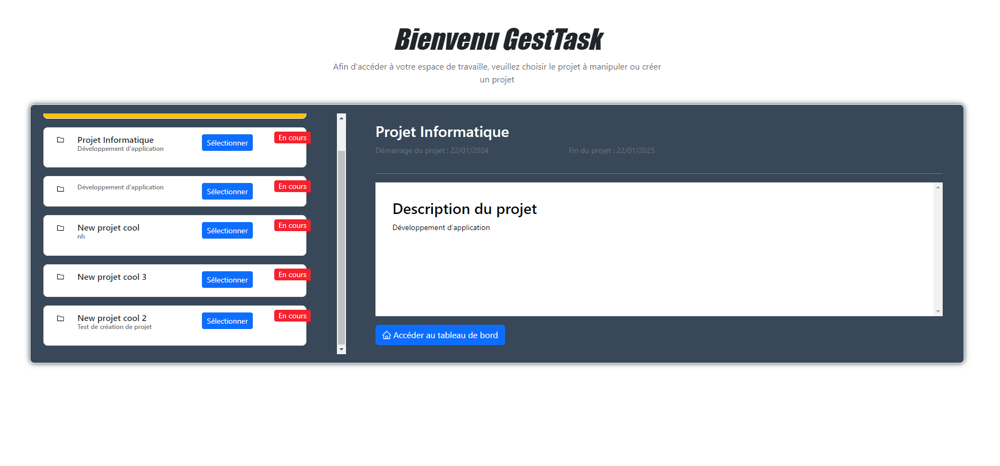

# TP_SIR_THOO_DENAHOU
[](https://forthebadge.com) [](https://forthebadge.com) [](https://forthebadge.com)

## Nom du projet : GestTask


## Description

GestTask est un projet conçu en s'inspirant de Trello, un outil de gestion de projet. En effet l'objectif est développer une application permettant la gestion d'un projet (ticket, issue en github). Pour y arriver nous avions m'y en place une API permettant de communiquer avec le serveur de base de données.


## Installation 
Avant de démarrer l'installation vérifier que les conditions ci-après sont remplies.

Vous disposer de : 
  - NodeJs dans sa **version 20.12.1**

1- Cloner le projet

```
git clone origin https://gitlab.istic.univ-rennes1.fr/othoo/tp_sir_react.git
```
NB: Assurez-vous que vous êtes de le bon répertoire. C'est-à-dire le dossier dans lequel vous souhaiteriez cloner le projet

2- Installation des dépendances

```
npm install
```

3- Démarrer le projet

```
npm run dev
```

## Présentation de l'interface de départ
La première page de notre application vous permet de sélectionner ou de créer un projet. Ceci est le point de dépert de l'application.




## Versions
**Dernière version stable :** Sur la branche **dev**

    
## Auteurs
Membres du binôme:
* **Omonliwi Graciela THOO**
* **Michaël Marino DENAHOU**

## License

[](https://lbesson.mit-license.org/)


